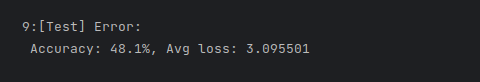

# Precog Recruitment Task

### - Ayan Datta (2021114017)

## Introduction

The task was to use the database of Indian District Courts and find Insights and develop a classification task.

## Libraries Used

- [Pandas](https://pandas.pydata.org/)
    - To manipulate and sample tabular data.
- [Dask](https://www.dask.org/)
    - To handle large datasets with parallel computing.
- [Pytorch](https://pytorch.org/)
    - To train classification model using deep learning.
- [Optuna](https://optuna.org/)
    - To automatically tune hyperparameters.

## Requirements setup

1. Set Up a Virtual Environment with python version >= python 3.10 and activate it.
2. Run the following command while inside the directory to install all requirements.

```shell
pip install -r requirements.txt
```

## Running The Jupyter Server

Run the following command to run a jupyter notebook in this folder from where all the notebooks can be accessed in a
webpage.
```shell
jupyter notebook
```

## Dataset used
- Judicial Data on District Courts was used from [Development Data Lab](https://www.dropbox.com/sh/hkcde3z2l1h9mq1/AAB2U1dYf6pR7qij1tQ5y11Fa/csv?dl=0&subfolder_nav_tracking=1)
This data is stored in a folder named [csv](csv).
```text
csv
├── acts_sections.csv
├── acts_sections.tar.gz
├── cases
│   ├── cases
│   │   ├── cases_2010.csv
│   │   ├── cases_2011.csv
│   │   ├── cases_2012.csv
│   │   ├── cases_2013.csv
│   │   ├── cases_2014.csv
│   │   ├── cases_2015.csv
│   │   ├── cases_2016.csv
│   │   ├── cases_2017.csv
│   │   └── cases_2018.csv
│   └── cases.tar.gz
├── judges_clean.csv
├── judges_clean.tar.gz
└── keys
    ├── keys
    │   ├── act_key.csv
    │   ├── cases_court_key.csv
    │   ├── cases_district_key.csv
    │   ├── cases_state_key.csv
    │   ├── disp_name_key.csv
    │   ├── judge_case_merge_key.csv
    │   ├── purpose_name_key.csv
    │   ├── section_key.csv
    │   └── type_name_key.csv
    └── keys.tar.gz
```
- Additional Data which was filtered from data in the csv folder and stored in the parquet file format in the folder named [Parquet](Parquet)
- Download the Parquet Data from [here](https://iiitaphyd-my.sharepoint.com/:u:/g/personal/ayan_datta_research_iiit_ac_in/EfHFGYQvmsZNunc64oTZqgcBOs7FgwhyYy9eUKUF4hEb4w?e=cZBKF7)
```text
Parquet
├── cases
│   ├── 2010
│   ├── 2011
│   ├── 2012
│   ├── 2013
│   ├── 2014
│   ├── 2015
│   ├── 2016
│   ├── 2017
│   └── 2018
├── cases_acts
│   ├── 2010
│   ├── 2011
│   ├── 2012
│   ├── 2013
│   ├── 2014
│   ├── 2015
│   ├── 2016
│   ├── 2017
│   └── 2018
├── features_classes
├── features_classes2
└── finished_cases
    ├── 2010
    ├── 2011
    ├── 2012
    ├── 2013
    ├── 2014
    ├── 2015
    ├── 2016
    ├── 2017
    └── 2018
```
### Why Use Parquet?

The linked article details why using the parquet file format is beneficial.
[Article Link](https://www.databricks.com/glossary/what-is-parquet)

## Analysis

### Sex Ratios Of Judges
The judge data of all the district courts was used and a state-wise and district-wise sex ratio was calculated.
- [Link to the notebook](judge_sex_ratios.ipynb)

### Duration of Finished Cases
- Cases were marked finished if they had a disposition date. 
- Duration of a case is the number of days between the date the case was filed till the date the case was disposed


#### Distribution of the duration of Finished Cases
The distribution of the duration of finished cases was analysed.

#### Durations of different types of finished cases
The durations of cases with respect to its various types was also analysed.


- [Link to the notebook](finished_cases.ipynb)

## Classification

The classification task chosen is as follows:
Predict the disposition of a case given its details like:
- Case duration
- Region
- Whether the defendant, petitioner are female
- Etc.

For this classification task, a subset of cases has been chosen which share some same characteristics.

### Subset of cases chosen

The subset of cases share these characteristics:
- Case type tagged with `cc`. Looking at criminal cases
- Case booked on act with id `17353`. Looking at cases booked on The Indian Penal Code.
- Case booked under section with id `865403`. Looking at cases under [section 338 of the Indian Penal Code](https://indiankanoon.org/doc/1721129/#:~:text=%E2%80%94Whoever%20causes%20grievous%20hurt%20to,thousand%20rupees%2C%20or%20with%20both).

#### Possible dispositions
There are a total of 34 possible dispositions that were observed.
- referred to lok adalat
- acquitted
- abated
- compromise
- transferred
- convicted
- withdrawn
- other
- dismissed
- disposed
- closed
- judgement
- confession
- fine
- plead guilty
- reject
- allowed
- committed
- disposition var missing
- p.o. consign
- compounded
- ex-parte
- award
- untrace
- probation
- remanded
- converted
- quash
- settled
- uncontested
- died
- 258 crpc
- execution
- stayed

### About the classifier model
The classifier was made using a Neural Network using the pytorch framework.


#### Inputs
- Duration (normalised by dividing by a large number, say 5000)
- years since 2010
- state code
- district code
- court number
- female defendant
- female petitioner
- female advocate defendant
- female advocate petitioner

#### Outputs
In the outputs each of the neuron corresponds to a disposition.

#### Activation Functions Used
- ReLU for the hidden layer.
- Softmax for the output layer.

#### Cost Function Used
Cross Entropy

#### How overfitting was minimised
- Weight Decay
- Splitting the data into `train` and `test`, and using `train` to train the model and using `test` to evaluate performance.

### Classification Accuracy


Just by using these basic features, we can predict around half of the dispositions correctly!

[Link to the notebook](disposition_predictor.ipynb)

## Future Work That Can Be Done

- [This notebook](court_cases_on_dates.ipynb) contains code to calculate the number of ongoing cases in every court on every day from 2010 till 2018. The code needs better computation hardware and more optimizing to run. Doing so will help get insights using that data.
- Study judges by the different kinds of dispositions they make, and how often they make them.
- Study judges by the duration of cases under them.
- Do a more in-depth study of how different types of cases are different from each other.
- Find a way to map districts properly with the given district names.
###  Improve Classifier
- Consider more features like:
  - How many cases are going on simultaneously?
  - What the most common disposition by the judge?
  - Some more case specific information.
  - etc.
- Use more Neural Network Techniques like dropout, better weight initialization, better ways of normalizing inputs, and better architectures. 

